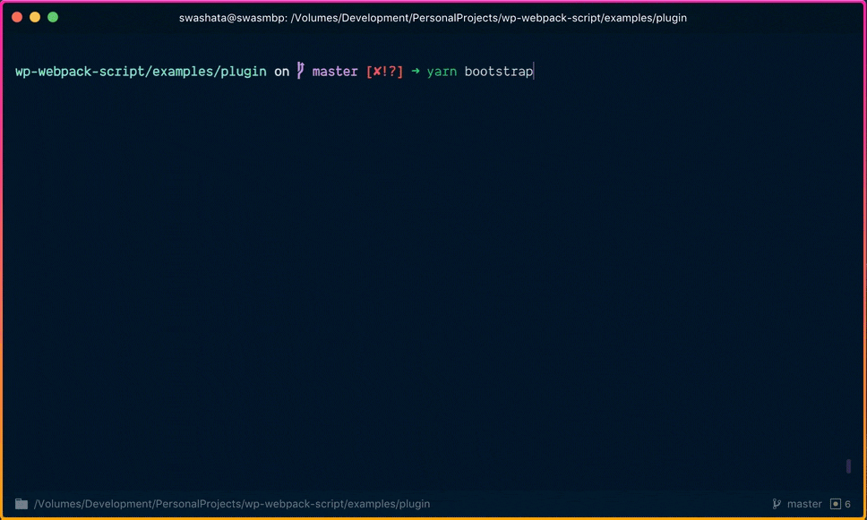
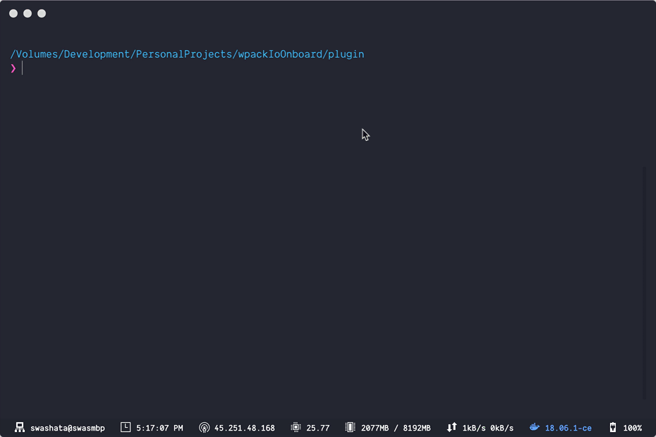
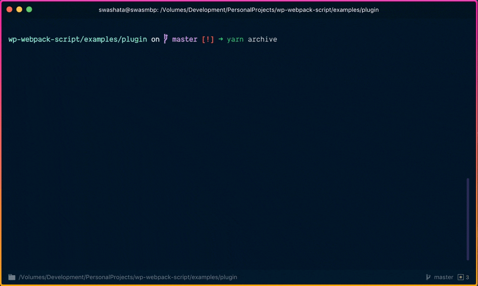

This is the main `devDependency` of your project which will give four
functionalities.

-   Bootstrap [project](/configuration/project-configuration/) and
    [server](/configuration/server-configuration/) configuration.
-   Start Development server.
-   Create production build files.
-   Create distributable zip files.

## Installation

```bash
npm i -D @wpackio/scripts
```

This gives you the `wpackio-scripts` binary within your `node_modules/.bin`.

## Usage

If you want you can run it directly like

```bash
`npm bin`/wpackio-scripts
```

OR

```bash
./node_modules/.bin/wpackio-scripts
```

But we would recommend creating different scripts under `package.json` file.

```json
{
	"scripts": {
		"bootstrap": "wpackio-scripts bootstrap",
		"start": "wpackio-scripts start",
		"build": "wpackio-scripts build",
		"archive": "wpackio-scripts pack"
	}
}
```

Now you can just do

```bash
npm run start
```

and it will invoke the command. If you have created your project with
[@wpackio/cli](/commands/wpackio-cli/), then it is already taken care for
you.

## CLI Commands

The cli app takes 4 commands and three optional parameters. Remember you
can always do something like this.

```bash
`npm bin`/wpackio-scripts --help
```

to find out more.

### `wpackio-scripts bootstrap`



Create [configuration files](/configuration/) on first run. If `wpackio.project.js`
is already present, then just create the `wpackio.server.js` file.

It also checks your `package.json` file and inserts `scripts` if not already
found.

```json
{
	"scripts": {
		"bootstrap": "wpackio-scripts bootstrap",
		"start": "wpackio-scripts start",
		"build": "wpackio-scripts build",
		"archive": "wpackio-scripts pack"
	}
}
```

### `wpackio-scripts start`


Starts the development server.

### `wpackio-scripts build`



Build production files.

### `wpackio-scripts pack`



Create a distributable `.zip` file for your WordPress plugin or theme.

## CLI Parameters

All of the commands take the following parameters.

### `-c, --context [path]`

Path to context or project root directory. Defaults to current working directory.

It is recommended to use absolute path, else it is calculated from current working directory.

The path you mention here should be what the URL `localhost/wp-content/<themes|plugins>/<slug>/` map to.

In most cases, you should leave it, because calling the program from npm or yarn script should automatically set it.

### `-p, --project-config [path]`

Path to project config. If it differs from `./wpackio.project.js`.

### `-s, --server-config [path]`

Path to server config. If it differs from `./wpackio.server.js`.

### `-h, --help`

Output usage information.
